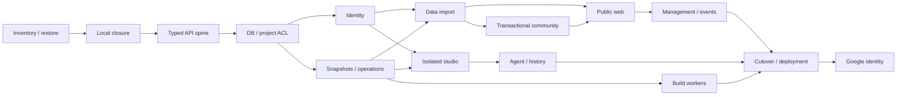

# Game Vault Production Delivery Implementation Plan

> **For agentic workers:** REQUIRED SUB-SKILL: Use superpowers:subagent-driven-development (recommended) or superpowers:executing-plans to implement this plan task-by-task. Steps use checkbox (`- [ ]`) syntax for tracking.

**Goal:** Deliver a maintainable multiuser Game Vault with verified accounts, project membership, isolated Theia and recoverable data/storage operations.

**Architecture:** Incremental modular-monolith migration, with a separate sandbox execution worker. One domain write owner at a time; route-specific compatibility switches preserve behavior until each replacement is accepted.

**Tech Stack:** TypeScript strict, Node 24 LTS API, Fastify 5, PostgreSQL 18/pg/SQL migrations, React 19/Vite/React Router, TanStack Query 5, existing Theia, Docker/runsc worker.

## Global Constraints

- Target deployment: Linux control-plane VM + separate Linux execution-worker VM.
- The initial worker uses Docker with the `runsc` gVisor runtime. Kubernetes is excluded from the initial deployment.
- All domain IDs are server-generated UUIDs. Relative display labels and legacy slugs are not storage keys.
- Inventory and a verified restore are required before changing product data.
- The existing Theia tests remain; failures caused by removed legacy references are cleaned up without replacing them with another editor test.
- Filesystem writes do not participate in SQL transactions. Consistency comes from a durable operation journal, immutable objects, idempotency and fencing.
- Public metadata is the DB release record frozen at publication; drafts do not leak into the public dashboard.
- No application bearer token, database password, provider key or runtime socket is present in a workspace.
- Framework migration, database migration and activation of accounts are separate packages and route switches.
- A system administrator manages users, quotas, runtime health and moderation; that role alone does not allow reading or editing private source.
- Production never installs wildcard dependencies; introduced versions and image digests are pinned and recorded.

---

## Program scope and review units

This is a delivery program across independent subsystems, not one atomic rewrite or a claim that all packages are approved implementations.
Each numbered package is independently rejectable/revertible. Its file list, interface, behavior and rollback below define its acceptance boundary.
The first package has a separate granular implementation plan: [P00 inventory/backup](2026-09-15-inventory-backup.md).
Later package implementation steps are expanded only against the delivered interfaces and current source; their acceptance/rollback contracts here are binding.
No framework/database/auth package is folded into another merely to reduce the number of changes.
The current workspace has no Git repository. Evidence/backup receipts are the initial revision boundary; P02 establishes version control before feature changes if the workspace still has no repository.
No uncreated commit/worktree is assumed to exist.

Inputs:

- [Architecture](../specs/2026-09-15-production-architecture-design.md)
- [Data/access model](../specs/2026-09-15-data-access-model.md)
- [Migration/recovery](../specs/2026-09-15-migration-recovery.md)
- [Revalidated audit](../specs/2026-09-15-validated-audit.md)
- [Baseline evidence](../evidence/2026-09-15-baseline.json)

## Dependency and activation order



P09/P11 development may proceed on fixture data while import/web work continues. Runtime activation waits for their dependencies and P12 acceptance.
No old mutable store keeps writing a domain after its v1 switch activates.

## P00 — Inventory and verified restore

**Goal:** Preserve the current post-legacy-deletion state and make every source/data import decision traceable.

**Files:** Create `scripts/migration/inventory.cjs`, `scripts/migration/backup.cjs`, `scripts/migration/verify.cjs`, `scripts/migration/cli.cjs`, `tests/migration/inventory-backup.test.cjs`; output private receipts outside the workspace. Detailed code/test cycle is in the linked P00 plan.

**Consumes:** Explicit source root, resolved external destination, frozen writer state, current lockfiles and diagnostic baseline.
**Produces:** `Inventory`, verified backup and restore receipt, classified project candidates; unresolved inputs remain listed.
**Dependencies:** Current filesystem only. No framework/database/auth installation.

- [ ] Discover source roots, formats, bytes, hashes, links and unresolved entry points without executing source hooks.
- [ ] Freeze actual writers and create a frozen inventory; environment files are excluded before reading/hashing/copying, per the user's explicit constraint. Credentials require separate operator provisioning, not retrieval by this task.
- [ ] Copy bytes to a new external restricted backup, verify every file, restore to a new empty directory.
- [ ] Reinstall pinned dependencies on the restore copy; run baseline contracts/HTTP checks and record known six failures separately.

**Behavioral tests:** `tests/migration/inventory-backup.test.cjs`: Unicode filenames, non-UTF-8 binary, malformed source manifest, external link, changing source, altered backup byte, unsafe destination, restore to nonempty target.
**Acceptance:** Every candidate has preserve/import/quarantine classification; copied/restored hashes and lengths match; restored application adds no failures to the observed baseline; receipt links the inventory and actual restore results.
**Rollback:** No original mutation. Preserve incomplete backup for diagnosis, resume frozen services; remove only confirmed generated temp directories if needed.
**Audit coverage:** Required preservation gate for all findings, particularly A05/A06/A20 and L04.

## P01 — Close current static exposure and legacy cleanup

**Goal:** Make the current local app's public-file boundary explicit and remove only obsolete editor references.

**Files:** Modify `backend/http/static-assets.js`, `server.js` static tail; create `backend/http/static-handler.js`, `backend/http/public-assets.json`, `tests/behavior/static-http.test.cjs`; modify `tests/asset-catalog-contract.test.js`, `tests/static-assets.test.js`, `tests/theia-workspace-theme.test.js`; retire `tests/chat-submit-contract.test.js` only after confirming it tests solely removed legacy chat. Modify `tests/system-tools.test.js` to use a temp fixture and `tests/project-layout-contract.test.js` to distinguish import candidates from canonical fixtures.

**Consumes:** P00 inventory/restore receipt and actual public asset references.
**Produces:** `createStaticHandler({root,publicAssetMap,onError}) -> (req,res,url)=>Promise<boolean>`; explicit asset map; controlled 404 and redacted 500 behavior.
**Dependencies:** P00. No new UI/framework/database.

- [ ] Write behavioral HTTP tests for actual active pages/scripts/play assets, unknown file, backend/data denial, traversal and junctions.
- [ ] Serve exact mapped pages/assets and inventory-approved playable assets; remove arbitrary repository-root fallback. Verify canonical realpath within each permitted physical root.
- [ ] Use 404 for absent asset/removed editor URLs; internal I/O errors log a request ID server-side and return a generic error without absolute paths.
- [ ] Remove D01..D04 references; keep and rerun the existing Theia tests. Replace T02's hardcoded product fixture with disposable data; T01 validates canonical data separately from legacy import candidates.
- [ ] Rerun contract and static behavioral suites on the current app; verify current required public assets remain available.

**Behavioral tests:** Anonymous `/server.js`, `/backend/auth/admin-account.js`, `/.vault/users.json`, `.env`, config/backup paths are never 200; `/theia.html` and shared `/project-tools.js` remain 200; nonexistent assets return 404; no test logs secret bodies. Encoded/double-encoded traversal, sibling-prefix and physical links do not expose fixtures outside the approved root.
**Acceptance:** A01/A02/A24 and D01..D05 closed; six baseline failures resolved through correct cleanup/fixture scoping, without adding fake game data or replacing Theia coverage.
**Rollback:** Restore previous code/assets from P00 while keeping the service loopback-only; a code rollback that restores the static exposure is never deployed publicly.

## P02 — Typed API spine and contracts

**Goal:** Introduce a focused API application with health/config/error/schema support while the current domains still use their existing backend.

**Files:** Create `apps/api/package.json`, `apps/api/tsconfig.json`, `apps/api/src/app.ts`, `apps/api/src/main.ts`, `apps/api/src/platform/config.ts`, `apps/api/src/platform/http/errors.ts`, `apps/api/src/platform/http/compatibility.ts`, `packages/contracts/src/{errors,health,versions,operations}.ts`, `tests/integration/harness.ts`, `tests/integration/api-spine.test.ts`; modify root `package.json`/lockfile for workspace scripts. Establish `.gitignore` and local version control after inventory when no repository exists; exclude secrets/storage/dependencies.

**Consumes:** P01 public handler and legacy route adapter; environment validated before listening.
**Produces:** `buildApp(deps): FastifyInstance`, typed ApiError/VersionSummary/OperationReceipt schemas, OpenAPI, `GET /health/live` and `/health/ready`, integration harness.
**Dependencies:** P01. No DB migration/account activation/React route switch.

- [ ] Test missing/invalid env, body limits, schema rejection, errors, request IDs and startup without side-effect metadata repair.
- [ ] Add Fastify module registration and narrowly scoped legacy compatibility adapter; do not paste the entire server router into main.ts.
- [ ] Establish strict typecheck, lint, formatting and contract generation; pin tool versions/lockfiles and Node24 API runtime.
- [ ] Keep legacy `/api` serving through explicit compatibility until a domain's v1 routes deliver; run old contracts plus new harness tests.

**Behavioral tests:** App factory does not start Theia, rewrite README or access secrets during construction. Bad JSON/body gets stable 400/413; unknown v1 endpoint gets 404; ready is false when a required dependency is unavailable; error schema never includes host stack/path.
**Acceptance:** API spine can run on a separate loopback port; main assembles dependencies only; typecheck/behavior tests pass; existing routes retain behavior.
**Rollback:** Stop new spine and use previous entry point; no domain data/schema was switched.

## P03 — PostgreSQL project model and access boundaries

**Goal:** Provide real project ownership/membership, stable versions and private/public query contracts.

**Files:** Create `infrastructure/database/migrations/001-identity.sql`, `002-projects-access.sql`, `003-storage-events.sql`; `apps/api/src/platform/database/{pool,transactions}.ts`; `apps/api/src/modules/projects/{schema,routes,service,repository,policy}.ts`; `apps/api/src/modules/versions/{schema,routes,service,repository}.ts`; `packages/contracts/src/{projects,access}.ts`; `tests/integration/{project-access,ownership-transfer,rls-isolation}.test.ts`.

**Consumes:** P02 contracts/Actor harness; test-only fixture identities and a narrowly scoped legacy admin-to-UUID compatibility mapping.
**Produces:** `requireProjectAction(actor,projectId,action): Promise<ProjectGrant>`; projects/versions typed read APIs; transactional owner transfer; deny-by-default route policies.
**Dependencies:** P02. PostgreSQL schema expansion only; legacy product import and new account signup remain inactive.

- [ ] Create constrained relational tables, project-scoped FKs, monotonic revisions and migration tracking; DB app role cannot bypass RLS.
- [ ] Implement owner/member permission matrix and platform capabilities as separate policy paths.
- [ ] Add explicit project member read, role change/transfer and label update contracts with revision preconditions.
- [ ] Test scope across two owners/projects and pooled DB connections; generated version/storage keys use UUIDs.
- [ ] Enforce transaction-locked quota admission and recipient quota checks on ownership transfer; quotas have their own revision/policy record.

**Behavioral tests:** Developer edits draft but cannot publish/transfer; maintainer cannot elevate maintainer or alter owner; system admin alone cannot read source; nonmember/private ID gets 404. Transfer race yields one owner, consistent membership and audit. Label changes leave version ID/storage key unchanged.
**Acceptance:** Matrix matches the model; versions array is schema-validated; stale precondition 409 and missing precondition 428; SQL migration/reuse isolation tests pass.
**Rollback:** Disable project-v1 routes; retain expanded schema and fixture data; no destructive down migration required.

## P04 — Accounts, email and persistent sessions

**Goal:** Real registration and security flows with account-scoped preferences, separate from frontend framework migration.

**Files:** Create `apps/api/src/modules/identity/{schema,routes,service,repository,passwords,sessions,email-actions,throttle,csrf}.ts`, `apps/api/src/adapters/mail/{smtp,development-sink}.ts`, `packages/contracts/src/{identity,preferences}.ts`, `tests/integration/{auth-flows,session-revocation,auth-throttle}.test.ts`; modify `frontend/pages/profile.html`, `frontend/scripts/profile.js` to consume v1 flows without introducing React; migration `004-preferences-community.sql` adds tables with no product import yet.

**Consumes:** P03 user/session schema, Actor/policy boundary; SMTP/mail sink; verified bootstrap principal.
**Produces:** register/verify/resend/login/reset/logout/device-list/revoke-all endpoints; persisted cookie sessions; `GET/PUT /api/v1/me/preferences`; validated relative return paths.
**Dependencies:** P03. New accounts first enabled on local/staging fixture data; public activation waits P12.

- [ ] Write behavior tests for all model policies: password bounds, Argon2, generic auth responses, token single use/expiry and shared rate buckets.
- [ ] Implement DB sessions, CSRF/Origin, cookie rotation and email outbox/retry; never carry the embedded admin password into production.
- [ ] Adapt existing profile page to honest registration/verification/reset/device states; retain form input and show delivery/retry errors.
- [ ] Connect project creation/execution/publishing permissions to active verified user and current auth epoch; close studio sessions on revocation.

**Behavioral tests:** Restart two API instances and preserve session validity; idle/absolute expiry; repeated verification/reset consumed once; logout-all revokes all devices; reset increments epoch. Five/email and twenty/IP login limits work across instances. Pending/suspended user cannot provision workspace. Redirect tests include `//host`, encoded backslashes/control characters and safe relative next.
**Acceptance:** Real email-sink flow verified end to end; no plaintext/shared password; persisted session/device rules match exact model policy; framework migration is absent from this package.
**Rollback:** Disable identity-v1 activation while preserving new accounts/session tables. Revert UI if necessary; do not route newly created accounts to the legacy shared-admin login. Keep a compatible v1 service/maintenance page for these users.

## P05 — Binary snapshots and durable file operations

**Goal:** Canonical source and cross-system writes are recoverable and race-safe.

**Files:** Create `apps/api/src/platform/storage-operations/{service,journal,reconciler,manifest,local-store,gc}.ts`; `apps/api/src/modules/versions/checkpoint.ts`, `apps/api/src/modules/projects/import-session.ts`; `packages/contracts/src/{snapshots,metadata-proposals}.ts`; migration `005-operations-snapshots.sql`; `tests/integration/{storage-recovery,checkpoint-conflicts,publish-concurrency,binary-restore}.test.ts`.

**Consumes:** P03 project grants/revisions; registered worker/storage ports; immutable source bytes and P00 inventory.
**Produces:**

```ts
checkpoint(actor: Actor, workspaceId: string, expectedDraftRevision: number, idempotencyKey: string): Promise<OperationReceipt>;
publish(actor: Actor, versionId: string, expectedDraftRevision: number, expectedMetadataRevision: number, expectedPublishedRevision: number, idempotencyKey: string): Promise<OperationReceipt>;
getOperation(actor: Actor, operationId: string): Promise<OperationStatus>;
```

`OperationStatus` contains operation ID, lifecycle state, progress and stable error code; it never exposes host paths or raw source to a nonmember.
**Dependencies:** P03/P04 for actor revocation. Tests use fixture workers; Theia is not rewritten here.

- [ ] Implement byte manifests, project-scoped blob keys and all-file hash validation; reject special/link/oversize/quota inputs explicitly.
- [ ] Persist operation before stage; enforce idempotency request hash, lease/fence and expected revisions.
- [ ] Commit source/release pointers only after verified bytes; record audit/outbox in same final transaction.
- [ ] Implement reconciler, safe quarantine and reference-aware GC; deletion first tombstones/revokes then stops runtime asynchronously.
- [ ] Add managed manifest proposals and preserve authored README; no automatic authority from uploaded owner/id/status/rating fields.

**Behavioral tests:** Crash after bytes_ready before SQL commit; retry same key returns one committed snapshot; changed payload under key conflicts. Concurrent same-base checkpoint retains stale candidate with 409. Concurrent publish changes one public pointer. Binary and >=1MB files round-trip hash-equal. Delete during publish invalidates the fence; old/new source pointers always resolve to complete verified snapshots.
**Acceptance:** Every cross-system operation has an observable terminal/retry state; no partial public project/release; active root is never deleted before verified replacement; fault-injection suite passes.
**Rollback:** Disable new writes, preserve journal and immutable objects, run compatible reconciler to settle outstanding operations; previous committed pointers remain readable. No bulk deletion of new objects to emulate rollback.

## P06 — Repeatable import of actual local data

**Goal:** Move real local source/accounts/community/history with verified mapping and no silent loss.

**Files:** Create `scripts/migration/{classify-projects,create-map,import-projects,import-identities,import-community,import-agent-history,reconcile,reverse-export}.ts`; migration `006-legacy-mappings.sql`; `tests/migration/{actual-dataset,idempotent-import,legacy-partial-history,reverse-export}.test.ts`; private migration-map/receipt files outside source tree.

**Consumes:** P00 backup/inventory; P03-P05 schemas/import ports; explicit verified bootstrap owner mapping.
**Produces:** `ImportOutcome` per source with imported/preserved/quarantined/rejected state, target UUID, reason, checksums; migration run/mapping/rollback receipts.
**Dependencies:** P04/P05. No React switch or public publication yet.

- [ ] Classify ten nonversioned applications by entry point/toolchain; preserve automation/backend inputs as nonplayable candidates when needed.
- [ ] Map t34 labels `2`/`v1.1.0` to fixed version IDs; preserve all source bytes and authored assets; eliminate generated legacy version URLs.
- [ ] Import operational data with unknown guest/authorship provenance and mandatory-reset legacy accounts.
- [ ] Mark incomplete UTF-8-era history as legacy-text-partial; do not enable destructive complete restore on it.
- [ ] Dry-run twice on a restored copy; compare rows, IDs, order, source checksums and unresolved entries; rehearse reverse export supported fields.

**Behavioral tests:** Actual dataset digest stable; two imports produce identical mappings/row counts; missing asset/invalid JSON/duplicate identity/label produces explicit retained outcome. Comments/replies/history/message order preserved. Unsupported new fields in reverse export stop rollback with a compatibility error instead of dropping data.
**Acceptance:** Every inventory source has an outcome; accepted bytes hash-equal; one owner fixed for each imported project; no original tree mutation; dry-run/idempotence/rollback receipts are reviewable.
**Rollback:** Before activation, discard only the isolated import database via its exact dedicated name and retain imported storage for inspection; original service still uses original data. After activation, follow write-watermark/reverse-export procedure, not this dry-run rollback.

## P06C — Transactional community backend

**Goal:** Preserve real ratings/comments/replies/activity and close the acknowledged-write race before public frontend activation.

**Files:** Create `apps/api/src/modules/community/{schema,routes,service,repository,guest-device,policy}.ts`, `packages/contracts/src/community.ts`, `tests/integration/{community-concurrency,guest-identity,community-permissions}.test.ts`; use P04/P06 community schema/import without a new framework/database migration.

**Consumes:** Imported comment/rating/activity records, authenticated actor or random guest-device cookie, publication visibility policy, identity throttle/CSRF ports.
**Produces:** `GET /api/v1/catalog/:projectId/community`, `POST /api/v1/catalog/:projectId/ratings`, `POST /api/v1/catalog/:projectId/comments`, reply/delete moderation endpoints and durable activity aggregation.
**Dependencies:** P04/P06. Public React migration is a separate next package.

- [ ] Write concurrent real-PostgreSQL tests for 20 comments, rating upsert, replies and ordered event records.
- [ ] Implement publication-scoped read/write; rating must be integer 1..5; comment/reply length 2..1200; text rendered as escaped plain content.
- [ ] Create random guest cookie identity and CSRF token; distinct browsers with identical User-Agent remain distinct, and legacy UA identities are not claimed automatically.
- [ ] Reply/moderation requires explicit project/platform capabilities; ordinary user can delete their own comment, not another user's; guest does not gain historical ownership.
- [ ] Throttle comments at ten/device/hour and thirty/IP/hour, ratings at thirty/device/hour and one hundred/IP/hour; validate trusted proxy IP chain and emit outbox events atomically.

**Behavioral tests:** 20 concurrent acknowledged comments remain 20 rows with unique IDs; same-user/project rating updates one row; cross-user deletion denied; private publication denies guest; guest cookies/CSRF cannot be replaced by body-supplied actor ID. Two identical-UA guests have different votes; old imported guest records retain historical provenance.
**Acceptance:** Community write owner is PostgreSQL; concurrency/privacy/moderation/input/rate tests pass; old compatibility routes delegate to this one service.
**Rollback:** Pause new community writes, preserve DB rows/outbox and use a compatible prior API. Re-enable JSON writes only after a complete watermark-bounded reverse export; no acknowledged comments are dropped.
**Audit coverage:** A07/A23 community race, L07 guest identity.

## P07 — Public frontend slice and preference import

**Goal:** Replace the public catalog/detail/account-preferences journeys with typed React routes and honest page states.

**Files:** Create `apps/web/src/app/{router,providers,query-client}.tsx`, `apps/web/src/features/catalog/{api,queries,CatalogPage,ReleasePage}.tsx`, `apps/web/src/features/preferences/{api,local-import,FavoritesPage,RecentPage}.tsx`, `apps/web/src/components/{AppShell,ReleaseCard,EmptyState,ErrorPanel,PermissionPanel,LoadingSkeleton}.tsx`; `packages/contracts/src/catalog.ts`; `tests/behavior/{catalog-navigation,play-download,preference-import,public-responsive}.spec.ts`; migrate public styling into shared tokens without replacing Theia.

**Consumes:** P04 account/preferences, P06 released catalog mapping and P06C community APIs; approved release-read API.
**Produces:** Public route build artifact, typed API/query keys, safe guest-to-account local preference import.
**Dependencies:** P06/P06C. Management HTML/profile/security can remain on their delivered routes until P08 adapts them.

- [ ] Build route-based public shell/components; URL controls filter/search/view; UI state uses React and server state uses Query.
- [ ] Wire release ID play/download links with user-content origin; no `data/games.json` fallback or draft metadata leakage.
- [ ] Render/retry public community views and submit rating/comment through the delivered transactional endpoints; server acceptance updates/invalidation are reflected without losing draft text.
- [ ] Fix favorites/recent navigation and delayed-response race through query isolation; import local data only after user consent and acknowledged success.
- [ ] Define/test catalog/detail/favorites/recent loading, empty, error, permission and 360px states.
- [ ] In the restored staging dataset, publish the selected imported t34 snapshot through P05 and test its public paths. Production imports remain member-only until the verified owner publishes; frontend migration does not automatically publish real projects.

**Behavioral tests:** Sidebar navigation/back/hash/search all show correct list; delayed old response never replaces fresh result; API 500 yields useful retry; corrupt localStorage survives; users A/B have separate preferences. Public play and download reach the selected immutable release; unauthorized private release stays unavailable.
**Acceptance:** Desktop/mobile keyboard user journeys pass against actual imported t34 release; no private source/account cache persists after logout/switch; screens reflect canonical released DB facts.
**Rollback:** Route-switch public frontend to delivered compatible old public page with v1 read adapter; keep v1 preferences/data. Preserve browser data until import acknowledgement.

## P08 — Management frontend and authorized event sync

**Goal:** Owners/members manage projects easily; committed changes reach management, public readers and studio without destructive polling.

**Files:** Create `apps/web/src/features/projects/{ProjectList,ProjectOverview,VersionList,MetadataForm,MembersPage,ImportWizard}.tsx`; `apps/web/src/features/security/{ProfilePage,SessionsPage}.tsx`; shared `FormField`, `UploadProgress`, `OperationStatus`, `ConfirmDialog`; `apps/api/src/modules/events/{routes,outbox,authorization,sse}.ts`; `packages/contracts/src/events.ts`; `tests/behavior/{member-management,dirty-form-sync,upload-resume,event-reconnect}.spec.ts`; retire old manage routes only after v1 acceptance.

**Consumes:** Project capabilities, version summaries, metadata proposals, import operations, account device APIs, outbox events.
**Produces:** Management routes, recipient-scoped `GET /api/v1/events`, targeted cache invalidation and responsive capability-aware controls.
**Dependencies:** P05/P07. Does not implement shared live editing.

- [ ] Replace management cards/forms with capability-aware routes; maintain form revisions and conflict display.
- [ ] Implement staged/resumable import wizard and operation progress; retained state on failed upload/delete.
- [ ] Add transactional outbox/SSE with ID replay, recipient ACL checks and revision-aware invalidation.
- [ ] Preserve dirty form/open-dialog state during updates; account switch resets private query state and event connection.

**Behavioral tests:** Maintainer/developer/viewer see appropriate actions and server enforces them. Metadata changed in tab A reaches clean tab B within five seconds; dirty B retains input and gets conflict on submit. Disconnect/reconnect replays or refetches; revoked member receives no later private payload. Failed second upload can resume/cancel without public half-project.
**Acceptance:** Project/versions/members/metadata/security page-state matrix below passes; no five-second whole-page rerender; current source/version/permission status is visible.
**Rollback:** Disable management-v1 routes and retain compatible v1 API adapter. Existing v1 imports/operations remain queryable/resumable; no independent legacy JSON write path is restored.

## P09 — Isolated Theia and workspace gateway

**Goal:** Keep Theia capabilities while enforcing per-user workspace isolation on a server.

**Files:** Create `apps/worker/src/supervisor/{routes,policy,leases}.ts`, `apps/worker/src/runtime/{docker-runsc,limits,network}.ts`, `apps/worker/src/{scanner,transfer}.ts`, `apps/api/src/modules/studio/{routes,service,repository,launch,revocation}.ts`, `infrastructure/worker/{Dockerfile,runsc-profile,egress-policy}`, `infrastructure/gateway/studio.conf`; migrate `theia/gv-extension/studio-module.js` into `theia/gv-extension/src/{toolbar,workspace,theme,problems}.ts`; `tests/security/{workspace-isolation,studio-launch,network-egress,resource-limits}.spec.ts`, `tests/behavior/theia-runtime.spec.ts`. Preserve existing Theia contracts and production bundle until new build passes.

**Consumes:** Verified Actor/project grant, version UUID/base snapshot, P05 checkpoint pipeline and worker capability registry.
**Produces:** provision/status/checkpoint/stop ports, private working copies, single-use POST launch, authenticated HTTP/WebSocket gateway, explicit scratch/project selector.
**Dependencies:** P04/P05; runtime tests use two fixture users/projects. Activation additionally waits management/import acceptance.

- [ ] Provision fixed-policy Docker/runsc workspace on separate worker VM; enforce actual CPU/RAM/PIDs/disk/network limits and reject arbitrary mounts/images/env.
- [ ] Implement challenge-bound launch ticket and host-only gateway session; strip credentials before Theia traffic forwarding.
- [ ] Replace host path/query-token toolbar integration with scoped API IDs, typed versions and revision/checkpoint status.
- [ ] Keep free studio as isolated user-owned scratch; attaching to a project requires explicit grant/new checkout.
- [ ] Run native Theia edit/save/terminal/problems/language-service/theme/agent-pane acceptance under runsc; revalidate ACL/session every five seconds on sockets.
- [ ] Update existing host-URI/query-credential contract assertions to workspace/gateway IDs in their current tests; retain capability behavior checks. Compare custom problem rules against a valid-template/HTML/CSS fixture corpus before claiming R01 resolved.
- [ ] Route Git/statistics/source export through scoped worker ports; expose host VS Code launch only in the explicitly local profile.

**Behavioral tests:** User A terminal cannot read B sentinel, host home, `/var/run/docker.sock`, metadata IP or provider keys. User controls `/workspace` only. Fork/memory/disk/network floods stay within effective limits. Launch ticket replay/expired/cross-user/challenge mismatch fails. Missing version returns 404 without provisioning. Revocation denies API immediately and closes socket <=5s. Valid saved bytes become canonical only through checkpoint; stale checkpoint retains candidate.
**Acceptance:** Real browser/PTY/language-server runsc tests pass; worker is physically/separately deployed from secrets/DB; no host terminal route remains enabled; Theia's existing capabilities/tests are preserved. Incompatibility blocks public studio activation; it never silently chooses the ordinary host runtime.
**Rollback:** Disable studio-v1 and stop its leases via gateway/supervisor; preserve dirty private copies and recoverable checkpoints. For local-only development an explicit isolated/local mode may remain; public service does not fall back to shared host Theia.

## P10 — Agent proposals and safe history

**Goal:** Repair actual chat edit/regenerate/actions and complete binary history on top of the delivered storage/ACL boundary.

**Files:** Create `apps/api/src/modules/agent/{routes,service,repository,proposals,provider}.ts`, `apps/api/src/modules/history/{routes,service,repository}.ts`; `theia/gv-extension/src/agent/{widget,api,actions,render}.ts`; migration `007-agent-history.sql`; `tests/integration/{agent-lineage,proposal-approval,history-restore}.test.ts`; remove duplicate legacy Agent route only when compatibility maps to this service.

**Consumes:** Project/source grants, P09 scoped workspace command/read ports, P05 snapshots/journal, P06 legacy history provenance.
**Produces:** Single Agent message handler with explicit edit/regenerate lineage; actor/workspace/revision-bound proposal approval; non-destructive restore operations.
**Dependencies:** P09/P06. AI-provider secret remains server-side; no provider call is necessary for stubbed behavior tests.

- [ ] Persist conversation/message lineage; support edit/regenerate/delete with revision checks and stable response schema.
- [ ] Proposals have actor, scope, expiry, payload hash and base revision. Approve rechecks permission/revision/lease and can execute only once.
- [ ] Agent file changes use snapshot operations; commands run only in P09 sandbox with explicit manual confirmation and bounded timeout/output.
- [ ] New history restores create a verified new revision; legacy-text-partial history offers preview/overlay rather than replacing the whole root.

**Behavioral tests:** Edit an existing user message and regenerate an assistant using stub transport; no duplicate route or silent new-message fallback. Approval by another project/user fails; replay/stale/expired proposals fail; command path never invokes control-plane exec. Restore JPG/big binary and compare hashes; interrupt restore and retain previous committed source.
**Acceptance:** Chat journeys pass in real Theia; actions/history use one scoped service/journal; no raw proposal internals replace understandable user feedback; incomplete legacy data is honestly labeled.
**Rollback:** Disable Agent writes while retaining conversation/history read and pending proposals; revert extension UI to compatible API. Do not re-enable the old host-command apply path.

## P11 — Durable capability-based builds

**Goal:** Supported platforms build verified immutable input without relying on the API host OS.

**Files:** Create `apps/api/src/modules/builds/{routes,service,repository,queue,artifacts}.ts`, `apps/worker/src/builds/{runner,linux,android}.ts`, `infrastructure/worker/build-images/`, `packages/contracts/src/builds.ts`, `tests/integration/{build-leases,build-artifacts,build-capabilities}.test.ts`, `tests/security/build-network.spec.ts`; adapt existing `frontend/scripts/build-manager.js` or delivered management build view.

**Consumes:** Authorized snapshot UUID/hash, worker target capabilities, P05 storage/journal and bounded log stream.
**Produces:** queued/leased/running/succeeded/failed/interrupted jobs, append-only ordered logs, checksum-verified authorized artifacts, explicit unavailable targets.
**Dependencies:** P05/P08 or existing UI adapter. It is independent of Google login.

- [ ] Implement SQL queue claims, lease renewal/fence, reclaim after worker loss and idempotent completion.
- [ ] Build only immutable snapshots with operator-pinned toolchains; project hooks run inside build sandbox with egress/quota policy.
- [ ] Produce Linux/Android on declared capable workers. Windows is unavailable until a separately isolated Windows worker is delivered; do not claim unsupported cross-platform capability.
- [ ] Verify artifact hash/size/format and authorized downloads; show platform availability before requesting job.

**Behavioral tests:** Two claimants never execute the same lease/fence; crash/reclaim logs survive; stale completion cannot overwrite. Input changes in Theia do not change an already queued snapshot. Missing Linux/Android toolchain produces unavailable capability, not a promised successful job. Real supported artifact launches/downloads on its target acceptance environment.
**Acceptance:** At least the declared initial targets have real artifacts, ordered durable logs and bounded isolation; UI only advertises tested target capability; no `electron:*` installation in production.
**Rollback:** Pause queue claims, settle/cancel leases, retain snapshots/artifacts/logs and old successful downloads. No host build fallback or deletion of completed artifact data.

## P12 — Production cutover, observability and rollback drill

**Goal:** Activate real server user journeys after data, isolation and recovery have demonstrated acceptance.

**Files:** Create `infrastructure/compose/{control-plane,worker}.yaml`, `infrastructure/gateway/{app,content}.conf`, `apps/api/src/platform/observability/{logging,metrics}.ts`, `scripts/operations/{backup,restore,cutover,rollback}.ts`, `docs/operations/{deploy,incident,restore}.md`; `tests/behavior/production-journeys.spec.ts`, `tests/migration/cutover-rollback.test.ts`.

**Consumes:** All P00-P11 receipts, pinned runtime digests, private production config, domain switches, final migration watermark.
**Produces:** deployed health/readiness/metrics, redacted request/audit correlation, backup/runbooks, tested one-domain-at-a-time route activation.
**Dependencies:** P08/P09/P10/P11 plus P06 reconciliation. P13 Google is optional later.

- [ ] Deploy TLS gateways on distinct app/studio/user-content origins, private DB/worker network and restricted secret/config mounts.
- [ ] Run registered security/migration/actual-user journeys in staging with effective worker limits; measure backup restore and revocation timings.
- [ ] Rehearse crash between bytes_ready/SQL commit and rollback after captured new writes; verify receipts/watermarks and compatible previous binary.
- [ ] Freeze writes, import final delta, verify counts/hashes, activate one domain switch and observe errors/operations before the next.
- [ ] Monitor auth failures, active leases, operation age, queue latency, storage/quota, event lag and backup freshness; redact secrets/PII in logs.

**Behavioral tests:** Register->verify->private project->invite->separate studio->conflict->publish->public play/download->revoke->binary restore. Restart API/worker/DB network and reconcile; roll back after new account/favorite/version writes without loss. New private/draft content remains unavailable on public asset origin.
**Acceptance:** All ten architecture journeys pass against actual migrated data; isolation/replay/fault tests pass; RPO/RTO measured; rollback receipt reviewed; no unexplained failing test or unresolved P0 remains.
**Rollback:** Freeze writes and preserve DB/file backup + outbox watermark; deploy previous new-schema-compatible service first. JSON rollback only through verified complete reverse-export; otherwise maintenance. Never destroy new data to reopen the old UI.

## P13 — Google provider, separate later delivery

**Goal:** Add Google sign-in/explicit linking without changing ownership/database/framework.

**Files:** Create `apps/api/src/modules/identity/providers/google.ts`, `apps/api/src/modules/identity/{oidc-flow,external-links}.ts`; `apps/web/src/features/security/ExternalAccountsPage.tsx`; `tests/integration/{google-login,google-linking,oidc-replay}.test.ts`.

**Consumes:** P04 identity/auth epoch/recent-auth/email policy and external identity uniqueness; operator-configured Google client.
**Produces:** code+PKCE/state/nonce OIDC login, explicit account link/unlink with `(issuer,subject)` key.
**Dependencies:** Stable identity/P12 deployment origins. No Redis/ORM/framework rewrite.

- [ ] Implement protocol via maintained OIDC library; validate issuer/audience/signature/nonce/expiry and one-use flow.
- [ ] Known provider subject logs into linked user; email collision asks existing authentication and explicit link.
- [ ] Link requires current recently authenticated session and purpose-bound callback; unlink cannot remove last authentication method.

**Behavioral tests:** Different subject with same email never enters/merges existing user; expired/state/nonce/PKCE mismatch and replay denied; session switched during link denied; identity already linked elsewhere 409; last-method unlink denied.
**Acceptance:** Controlled real Google account login/link works, mocked adversarial cases pass, no token/secret appears in URL logs/workspace.
**Rollback:** Disable provider routes/button; keep identity links and local login/recovery working; do not delete users or reassign memberships.

## Page-state acceptance matrix

All loading/empty/error/permission/mobile cases are implemented with shared components but tested per journey.

| Page | Loading / empty | Error | Permission | Mobile / interaction |
| --- | --- | --- | --- | --- |
| Catalog/search | Card skeleton / no published games or no matches | Retry and retain filter | Published access only | 360px cards/filter drawer; back restores URL state |
| Release detail | Cover/detail skeleton / release missing | Retry exact release | Private unauthorized ->404; members login when appropriate | Play/download reachable; no overflow |
| Favorites/recent | Scoped skeleton / import or explore action | Retain local import payload until acknowledgement | Per-account scope | Same controls as catalog; account switch clears cache |
| Registration/login | Pending submit / explain verification | Field errors or generic login/reset outcome | Pending user limited to verification/security | Keyboard labels/autofill; no unsaved-input reset |
| Profile/security | Scoped skeleton / no other devices/providers | Retain edit and bounded retry | Own account only, recent-auth for sensitive actions | Device cards stacked; logout-all confirmation accessible |
| Projects/overview | Skeleton / create authorized project | Scoped retry | Member capabilities; nonmember404 | Drawer navigation, cards, visible operation status |
| Versions/metadata | Version list skeleton / create draft action | Revision conflict with retained patch | Action-specific capability | Label/forms stacked; dirty state survives events |
| Members | List skeleton / invite prompt | Retain invitation; field/role conflict | Owner vs maintainer grant boundaries | Accessible role dropdown and destructive-action dialog |
| Upload wizard | Part progress / choose supported source format | Resume/cancel; never reset successful parts | Verified actor/project quota | Stepwise form/progress; file limits before submit |
| Studio launch/IDE | Lease startup/checkpoint state / choose project or scratch | Runtime unavailable or recoverable checkpoint conflict | Version checked; revoke closes connection | Full-screen option; retain explicit unsaved/dirty status |
| Agent/history | Message/snapshot loading / empty conversation/history | Retry without duplicated mutation; partial-legacy warning | Conversation/project scope | Collapsible pane, readable diffs/confirmations |
| Builds | Queue/progress / no builds or unsupported capability | Bounded logs/actionable failure | Authorized member download/request | Logs horizontally scroll; artifacts reachable |
| System operations | Health skeleton / no incidents | Dependency failure and retry | Platform role without source access | Readable bounded tables/cards |

## Testing and rollback gates

Unit tests cover policy/manifest/state-machine logic. Integration tests run against disposable PostgreSQL, never the product database.
Browser tests cover real navigation/forms/account isolation/play/download/IDE. Security tests run against disposable worker images and sentinel data.
Migration tests use restored actual data with secret values redacted from reports; binary acceptance always compares length/hash.
Source-string contracts remain useful regression guards but do not substitute for behavior tests.
Each delivered package records introduced interfaces, test command/results, remaining classified risks, schema/storage effects and exercised rollback.
Only new failures/changes/uncertainties justify broader repeated verification.

## Definition of a professional delivery

A reader can identify the owner of each behavior from a module interface.
Routes do not own SQL/command execution; UI does not own canonical catalog; storage does not decide user permission.
User-visible completion means a committed, verified operation, not just a successful file write or HTTP request.
Code/schema/contract generation, formatting and behavioral acceptance are part of each delivered slice, not a cleanup phase after a giant merge.
